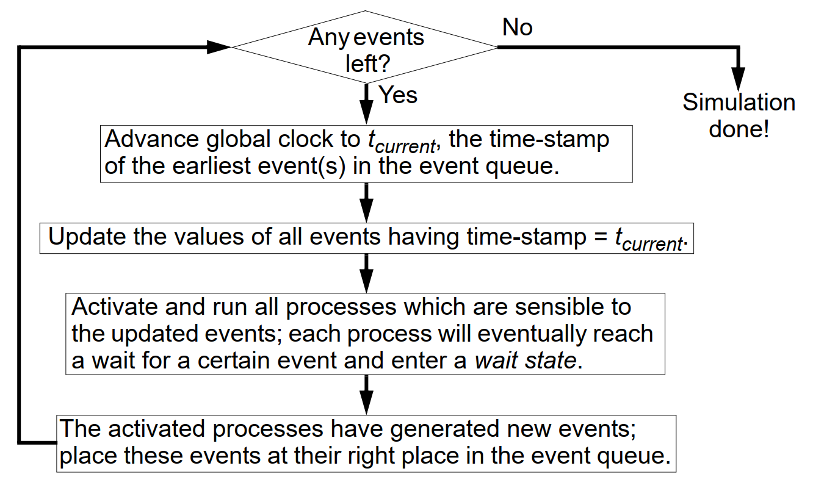

# "Guaranteed" Questions

---

### Concurrency (3p)
- a) What does it mean by data-driven and control-driven concurrency?
- b) Give an example for each of them.

> a) 
> **data driven**:
> - the model has no specification of the order of tasks
> 
> tasks have to wait for the data that they process. this can be a task waiting for another task to finish pre processing. or a task waiting for a sensor to deliver new input data.

> **control driven** 
> - order of execution is explicitly modelled
> 
> tasks are running because of a schedule or top level scheduler without the need to wait for data.

> b)
> - data driven: DSP applications
> - control driven: static schedule

---

### Design Flow (3p)
- a) Describe, using a flow graph, the design flow of an embedded systems, from an informal specification to fabrication.
- b) Give short comments on the design steps which belong to the system-level.


---

### Synchrony Hypothesis (2p)
- a) Formulate the synchrony hypothesis for FSMs. What does it imply?
- b) Under which assumptions can we correctly implement a synchronous FSM model?

> a) all events in an FSM happen instantly. 
> It implies an ideal model with zero-delay computation (of output) and communication (internally or with other FSMs).

> b) The reaction time of the system (including internal communication) is 
> neglectable compared to the rate of external events.

---

### Synchronization Dependency (2p)
- a) What does it mean by control-dependent and data-dependent synchronization?
- b) Give an example for each? 

> a) under control-dependent synchronization, the control structure is responsible for the synchronization. 
> example: 
> - we have a static schedule of tasks that are running sequentially

> b) under data-dependent synchronization, the synchronization happens upon a change of data. 
> example: 
> - a task is polling for a memory location to change
> - interrupt triggers an ISR 

---

### Discrete Event Simulator (2p)
- How does a discrete event simulator work? Illustrate by a flow-graph. 



---

### Globally Asynchronous Locally Synchronous (GALS) (2p)
- Give an example and show how determinism is lost with a GALS model as opposed to a synchronous FSM. 


> Assuming you synchronize 2 locally synchronous FSMs in a globally asynchronous model.
> The communication between the 2 FSMs is through a (FIFO) buffered channel.
> Both FSMs can now be modelled with a different time step.
> If the sending FSM outputs messages at 100 Hz and the receiving FSM reads at 50 Hz, some messages are discarded.
> Because the two FSMs are not globally synchronized, there is no way to determine, which messages are discarded.

> Both FSMs can be formally verified but not the global system.
> The global system can however be synchronous if timing requirements (sender vs. receiver speed) are properly designed.

---

### Petri Nets (3p)
We have identified three properties which can be analyzed on systems modeled as Petri Nets:
- Boundedness.
- Liveness.
- Reachability.

How is each of these properties defined?
What is the practical significance of each of these properties (what does it say about the system)? 

> - **boundedness**: number of tokens in a place does not exceed a limit. available resources are not exceeded
> - **liveness**: for every system state, a transistion can be activated, important for deadlocks
> - **reachability**: existence of a sequence from state X to Y, important to check if states are reached/never reached

---

### Petri Nets Determinism
a) Are Petri Net models deterministic?

> no

---

### ASIP (3p)
What does it mean by an Application Specific Instruction Set Processor (ASIP)? 
We have discussed four dimensions of specialization for ASIPs. Which are those four?
Comment on each of them. 

1. **Instruction Set** (remove / add)
	- introduce specialized instructions 
	- e.g. SIMD (single-instruction-multiple-data) in GPUs or MACC (multiply-accumulate) in DSP
2. **Function unit and data path**
	- implementation of the instruction set
	- word length, register count, additional ALU
	- new peripherals (e.g. ECC, CRC, cryptographic functions, pixel operations)
3. **Memory**
	- count + size, number of parallel r/w access ports, cache size & associativity
4. **Interconnect**
	- number of buses, protocols, parallelism
	- direct interconnects (CPU scratchpad)

---

### ASIC vs. CPU (2p)
Illustrate by a diagram the trade-off energy consumption vs. flexibility for ASIC, FPGA, ASIP, and general-purpose processor. 

```
energy
^
|                 CPU
|           ASIP
|      FPGA
| ASIC
+---------------------> flexibility
```

---

### Processor Specialization (ASIP) Design Flow (2p)
Describe a simple design flow for processor specialization. Illustrate also by a figure. 
Comment on the design tools you need.

How does this differ from the design flow for a platform definition?


> use tools like MPARM to simulate the algorithms on the newly specified architecture

> Difference to platform definition: there is only a single algorithm for a single processor. 
> No mapping is required.

---

### Dynamic Voltage Scaling DVS (3p)
- a) What is the basic principle for task scheduling on DVS processors?
- b) What is the problem if we consider particularities, concerning power consumption, of individual tasks?
- c) How do we solve the problem that only discrete voltage levels are available?
- d) Discuss what the problems are if leakage energy is ignored.

> a) _"If a processor uses a single supply voltage and completes a program just on deadline, the energy consumption is minimised."_

> b) The problem is: Which task to execute at a certain moment on a certain processor **at which voltage** so that time constraints are fulfilled **and energy consumption is minimized**.
> Because, changing clock and voltage uses energy and time. If it is done too often, it will consume more energy than just keeping a constant frequency. Since the occurrence of high resource tasks is non deterministic, there is the challenge of deciding if/when/how often to change the power state.

> c) Since voltage levels are discrete, but time is virtually continuous, we can decide when to switch from the _lower than ideal voltage_ to the _higher than required voltage_. Thereby we can still finish a task at its deadline by running it at two different voltages.

> d) Dynamic Energy (per cycle) scales linarly with the voltage. Leakage however grows larger with low voltages. If the voltage is reduced too much, energy consumption risies again due to the increased leakage current.


---

### Dynamic Power Management (3p)
We have introduced three particular policies for shut-down with Dynamic Power 
Management: time-out, predictive, and stochastic. Describe the main characteristics of each. 
Compare.

> **time-out**: if a device is idle for some time, it might be idle for a longer time --> switch to lower power state.
> disadvantage: will consume energy more energy while waiting for shut down
> **predictive**: tries to predict the duration of idle time and shut down immediately 
> **stochastic**: also predictive but with more complex models / machine learning / stochastic analysis methods

---

### Kahn Process Networks (3p)
Define Kahn process networks.
Show by an example how determinism is guaranteed with Kahn process networks.
Transform the example and show that a more general dataflow network, which is not a Kahn 
process network, does not guarantee determinism.

> **Definition**: Synchronous dataflow networks are Kahn process networks with restriction:
> - At each activation (firing) a process produces and consumes a fixed number of tokens on each of its outgoing and incoming channels
> - For a process to fire, it must have at least as many tokens on its input channels as it has to consume

> - deterministic
> - dynamic (data dependent, no static schedule)
> - memory for message passing (memory overhead)

> The example: **reads are blocking** (writes are non-blocking). 
> If you remove the blocking-read property e.g. by a timeout, determinism is also lost.

---

### IP Core Design (2p)
What does it mean by IP (core) based design? What types of cores can you choose from? 
Comment on each of them.

> - **Hard Core**: placed & routed silicon design from IP manufacturer with guaranteed timing
> - **Firm Core**: netlist design from IP manufacturer without guaranteed timing to place yourself
> - **Soft Core**: HDL code from IP manufacturer to integrate in own RTL design

---

### Static Cycling Scheduling (2p)
What are the advantages/disadvantages of static cyclic scheduling?

> **Advantages**
> - predictable
> - easy to debug
> - low overhead in execution time

> **Disadvantages**
> - inflexible
> - polling instead of interrupt events
> - manual splitting of tasks

---

### Static Schedule (3p)
a) Formulate the scheduling problem for a set of real-time tasks. What does it mean that a task set is schedulable?
b) How does it change if energy optimisation is taken into consideration?
c) What does it mean by preemptive and non-preemptive scheduling?

Todo

> a) Which task and communication has to be executed at a certain moment on a 
> given processor or bus respectively, so that time constraints are fulfilled?
> A set of tasks is schedulable if, given a certain scheduling policy, all 
> constraints will be completed.

> b) 

> c) Preemptive means that the tasks have priorities associated. Higher priority tasks can interrupt the runtime of lower priority tasks. Non preemptive means that tasks always run to completion (but priorities can still exist for the next task).

---

### Discrete Event Simulator (2p)
What is the problem with discrete event simulators and zero delay components? How can it be solved? Illustrate by an example.

> In practice there is no zero delay. 
> That is why it is modelled as a Delta delay, which tells the simulator that the two events separated by a delta delay are immediately followed by each other.

---

### Timed Automata (3p)
Timed automata are a particular (the simplest) form of hybrid automata. Give an example of 
a timed automata model of your choice. Explain the model. Specify the same model as 
hybrid automata.


> In the hybrid automata the clock `x` is replaced by a differential equation in each state.
> For a simple clock, the equation becomes `x'(t) = 1` which means, the clock is always rising (counting) in each state.

---

### Dynamically Reconfigurable Datapath (2p)
We have introduced Systems on Chip with a dynamically reconfigurable datapath; this 
datapth can be reconfigured to act as an accelerator for the actual program running on the 
processor. What are the main steps for compiling the source code for such a system? What 
will result as the outcome of this compilation?


> **main steps**
> - profiling of code
> - partitioning into HW/SW
> **output**
> - new C code
> - netlist / bitstream for datapath 


> Sidenote for understanding "reconfigurable datapaths":
>
> This is inside of an SoC which is reconfigurable like an FPGA but also relatively _general purpose_.
> (e.g. a smartphone processor SoC - according to P.E.)
> There are functional units inside the SoC which can be directly connected with a reconfigurable interconnect, 
> instead of using a regular bus.
> Functional units that belong together can be interconnected more efficiently.
